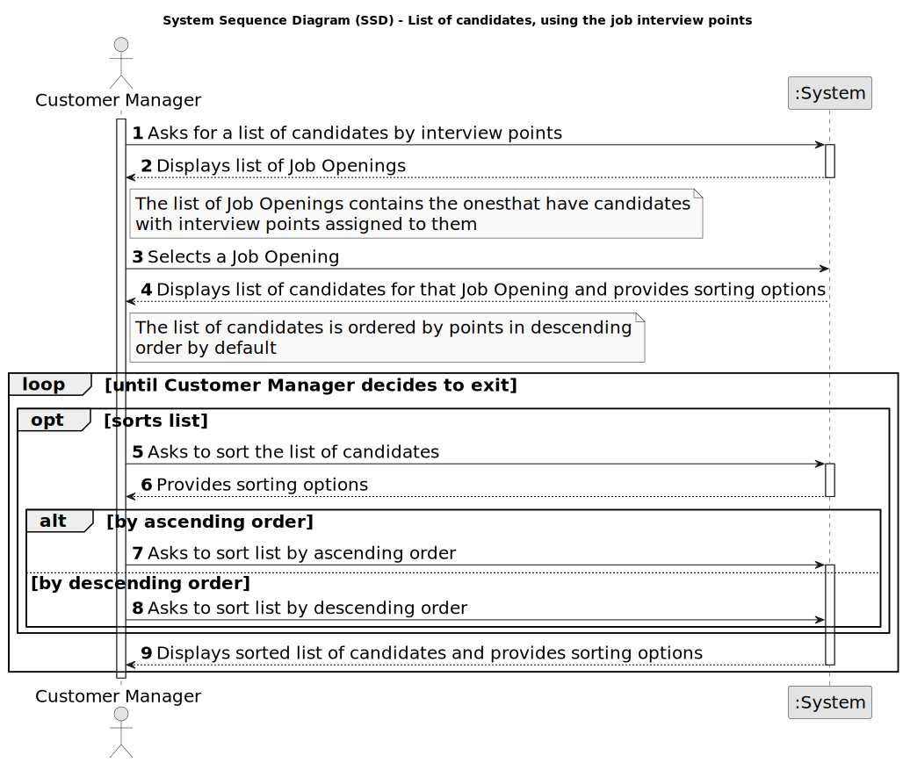

# US 1019 - Get an ordered list of candidates, using the job interview points

## 1. Requirements Engineering

### 1.1. User Story Description

* As Customer Manager, I want to get an ordered list of candidates, using the job interview points (grades), to help me analyze the candidates.

### 1.2. Customer Specifications and Clarifications

**From the specifications document:**

_N/A_

**From the client clarifications:**

_N/A_

### 1.4. Found out Dependencies

* **US 1018 - Execute the process that evaluates the interviews for a job opening:** The system must have the job interview points to be able to order the candidates.

### 1.5 Input and Output Data

**Input Data:**

_N/A_

**Output Data:**

* (In)Success of the operation
* List of candidates ordered by job interview points

### 1.6. System Sequence Diagram (SSD)

