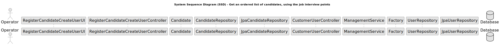

# US 1019 - Get an ordered list of candidates, using the job interview points

## 3. Design - User Story Realization

### 3.1 Rationale

| Interaction ID | Question: Which class is responsible for... | Answer               | Justification (with patterns)                                                                                 |
|:-------------  |:--------------------- |:---------------------|:--------------------------------------------------------------------------------------------------------------|
| Step 1  		 |	... interacting with the actor? | RegisterCandidateCreateUserUI          | Pure Fabrication: there is no reason to assign this responsibility to any existing class in the Domain Model. |
| 			  		 |	... coordinating the US? | RegisterCandidateCreateUserController | Controller: The controller is responsible for handling the user's request and coordinating the use case. |
| 			  		 |	... creating the candidate?						 | Candidate         | Information Expert: The Candidate class knows how to create a new Candidate. |
| 			  		 |	... saving the candidate?						 | CandidateRepository         | Information Expert: The repository knows how to save a candidate. |
| 			  		 |	... querying the database for candidates?						 | JpaCandidateRepository         | Information Expert: The JpaCandidateRepository knows how to interact with the database. |
| 			  		 |	... coordinating the candidate registration?						 | RegisterCandidateCreateUserController         | 	Controller: The controller is responsible for handling the user's request and coordinating the use case. |
| 			  		 |	... creating the user?						 | Factory	         | Creator: The Factory knows how to create a new User. |
| 			  		 |	... saving the user?						 | UserRepository	         | Information Expert: The repository knows how to save a user. |
| 			  		 |	... querying the database for users?						 | JpaUserRepository	         | Information Expert: The JpaUserRepository knows how to interact with the database. |

### Systematization ##

According to the taken rationale, the conceptual classes promoted to software classes are:

* Candidate
* User

Other software classes (i.e. Pure Fabrication) identified:

* RegisterCandidateCreateUserUI
* RegisterCandidateCreateUserController
* CandidateRepository
* JpaCandidateRepository
* CustomerUserController
* ManagementService
* Factory
* UserRepository
* JpaUserRepository

These classes are responsible for the user interface, controlling the use cases, creating and saving the candidates and users, and interacting with the database, respectively.

## 3.2. Sequence Diagram (SD)

## 3.3. Class Diagram (CD)

