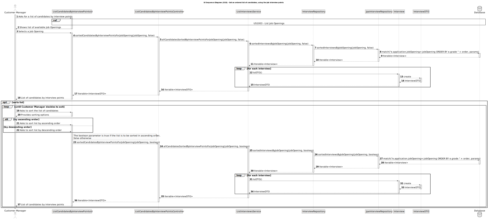

# US 1019 - Get an ordered list of candidates, using the job interview points

## 3. Design - User Story Realization

### 3.1 Rationale

| Interaction ID | Question: Which class is responsible for... | Answer               | Justification (with patterns)                                                                                 |
|:-------------  |:--------------------- |:---------------------|:--------------------------------------------------------------------------------------------------------------|
| Step 1  		 |	... interacting with the actor? | ListCandidatesByInterviewPointsUI          | Pure Fabrication: there is no reason to assign this responsibility to any existing class in the Domain Model. |
| 			  		 |	... coordinating the US? | ListCandidatesByInterviewPointsController | Controller: The controller is responsible for handling the user's request and coordinating the use case. |
| 			  		 |	... querying the database for interviews?						 | JpaInterviewRepository         | Information Expert: The JpaInterviewRepository knows how to interact with the database. |
| 			  		 |	... converting the interviews to DTOs?						 | Interview         | Information Expert: The Interview class knows how to convert itself to a DTO. |
| 			  		 |	... creating the DTO?						 | InterviewDTO	         | Creator: The InterviewDTO knows how to create a new InterviewDTO. |

### Systematization ##

According to the taken rationale, the conceptual classes promoted to software classes are:

* Interview
* InterviewDTO

Other software classes (i.e. Pure Fabrication) identified:

* ListCandidatesByInterviewPointsUI
* ListCandidatesByInterviewPointsController
* JpaInterviewRepository

These classes are responsible for the user interface, controlling the use case, and interacting with the database, respectively.

## 3.2. Sequence Diagram (SD)

## 3.3. Class Diagram (CD)

