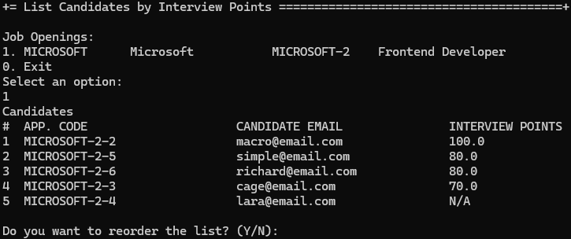
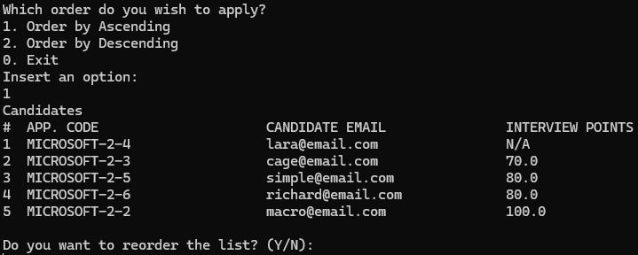

# US 1019 - Get an ordered list of candidates, using the job interview points

# 4. Tests

**Some tests of the ListCandidatesByInterviewPointsController**
```java
@BeforeEach
void setUp() {
    MockitoAnnotations.openMocks(this);
    when(mockInterview.toDTO()).thenReturn(mockInterviewDTO);
    when(mockRepo.sortedInterviewsByJobOpening(mockJobOpening, false)).thenReturn(Arrays.asList(mockInterview));
    controller = new ListCandidatesByInterviewPointsController(mockRepo, mockAuthz);
}

@Test
void testAllCandidatesSortedByInterviewPointsForJobOpeningNotNull() {
    Iterable<InterviewDTO> result = controller.allCandidatesSortedByInterviewPointsForJobOpening(mockJobOpening,
            false);
    assertNotNull(result);
}

@Test
void testAllCandidatesSortedByInterviewPointsForJobOpeningReturnsExpectedInterviews() {
    Iterable<InterviewDTO> result = controller.allCandidatesSortedByInterviewPointsForJobOpening(mockJobOpening,
            false);
    List<InterviewDTO> resultList = (List<InterviewDTO>) result;
    assertEquals(mockInterviewDTO, resultList.get(0));
}

@Test
void testAllCandidatesSortedByInterviewPointsForJobOpeningCallsEnsureAuthenticatedUserHasAnyOf() {
    controller.allCandidatesSortedByInterviewPointsForJobOpening(mockJobOpening, false);
    verify(mockAuthz).ensureAuthenticatedUserHasAnyOf(BaseRoles.CUSTOMER_MANAGER, BaseRoles.POWERUSER);
}
```

**Some tests of the ListInterviewsService**
```java
@BeforeEach
void setUp() {
    MockitoAnnotations.openMocks(this);
    when(mockInterview.toDTO()).thenReturn(mockInterviewDTO);
    when(mockRepo.sortedInterviewsByJobOpening(mockJobOpening, false)).thenReturn(Arrays.asList(mockInterview));
    service = new ListInterviewsService(mockRepo);
}

@Test
void testSortedInterviewsByJobOpeningNotNull() {
    Iterable<InterviewDTO> result = service.sortedInterviewsByJobOpening(mockJobOpening, false);
    assertNotNull(result);
}

@Test
void testSortedInterviewsByJobOpeningReturnsExpectedInterviews() {
    Iterable<InterviewDTO> result = service.sortedInterviewsByJobOpening(mockJobOpening, false);
    List<InterviewDTO> resultList = (List<InterviewDTO>) result;
    assertEquals(mockInterviewDTO, resultList.get(0));
}

@Test
void testSortedInterviewsByJobOpeningCallsSortedInterviewsByJobOpening() {
    service.sortedInterviewsByJobOpening(mockJobOpening, false);
    verify(mockRepo).sortedInterviewsByJobOpening(mockJobOpening, false);
}
```

# 5. Construction (Implementation)

**ListCandidatesByInterviewPointsController**
```java
@UseCaseController
public class ListCandidatesByInterviewPointsController {
    private final AuthorizationService authz;
    private final ListInterviewsService listInterviewsService;

    public ListCandidatesByInterviewPointsController(InterviewRepository interviewRepository,
            AuthorizationService authz) {
        this.listInterviewsService = new ListInterviewsService(interviewRepository);
        this.authz = authz;
    }

    public Iterable<InterviewDTO> allCandidatesSortedByInterviewPointsForJobOpening(final JobOpening jobOpening, final boolean ascending) {
        authz.ensureAuthenticatedUserHasAnyOf(BaseRoles.CUSTOMER_MANAGER, BaseRoles.POWERUSER);
        return listInterviewsService.sortedInterviewsByJobOpening(jobOpening, ascending);
    }
}
```

**ListInterviewsService**
```java
public class ListInterviewsService {

    private final InterviewRepository interviewRepository;

    public ListInterviewsService(InterviewRepository interviewRepository) {
        this.interviewRepository = interviewRepository;
    }

    public Iterable<InterviewDTO> sortedInterviewsByJobOpening(final JobOpening jobOpening, final boolean ascending) {
        final Iterable<Interview> interviews = this.interviewRepository.sortedInterviewsByJobOpening(jobOpening,
                ascending);
        List<InterviewDTO> InterviewsDTOS = new ArrayList<>();
        interviews.forEach(interview -> InterviewsDTOS.add(interview.toDTO()));
        return InterviewsDTOS;
    }

}
```

# 6. Integration and Demo

In the following image, we can see a demonstration of the implementation of the US 1019. The image shows the list of candidates for a job opening, ordered by the points obtained in the interview.

<p align="center">List Candidates By Interview Points</p>



In order to list the candidates by interview points, the user must select the job opening, the list will be displayed in ascending order by default.

<p align="center">List Candidates By Interview Points</p>



The user can change the order of the list by selecting the "Reorder" option. The user can then select the "Ascending" or "Descending" option to change the order of the list.

# 7. Observations

The implementation of the US 1019 was successful. The tests were executed without any errors, and the implementation was demonstrated in the application.

