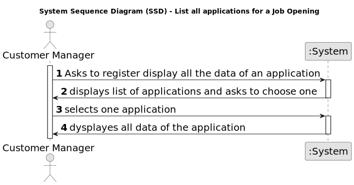

# US 1021 - listDataOfAnApplication.

## 1. Requirements Engineering

### 1.1. User Story Description

* As Customer Manager, I want to display all the data of an application

### 1.2. Customer Specifications and Clarifications

**From the specifications document:**

- There is an Applications Email Bot (outside of scope for this project) that is continuously
  processing these emails. The Bot processes the emails and produces (in a predefined folder)
  the following content/files (using the same file prefix for files of the same application):
  • A text file with the contents of the email
  • A file for each file attached to the email (usually PDF files)
  • A text file with the contents of each file attached to the email (processed by an OCR tool)
  • A text file with the data of the application and candidate, with at least:
  – job reference
  – email of the candidate
  – name of the candidate
  – phone number of the candidate
  There is a second bot application, named Applications File Bot, that processes these files for
  integration in the system. The Applications File Bot is continuously monitoring the previous
  referred folder for new applications to be processed. The Bot should copy the files for a shared
  folder. This shared folder should be organized by job reference (top folders) and then by application (sub folder inside the job reference folder). The Bot should produce a text report of
  all the processed applications (including applications for job references and files available).
  The Operator of the Backoffice will import the files produced by the Applications File Bot
  and register the applications, creating candidates that dot not exist in the system.

  **From the client clarifications:**

> **Date:** 2024-04-20
>
> **Question Q106:**
I was thinking about if the candidate could change his/her email. In older questions you said the email was the identificator of the candidate, isn't it? Should we put another id made by sequence numbers or by his NIF, for example, to identificate him/her in the system? Could we say the same for the user who is managing the app of the customer?
>
> **Answer:**
A106 The field/data that identifies the user in the system is always the email (it must be unique). For the moment there is no need for supporting the possibility of changing the email or add any other identification possibility.

> **Date:** 2024-04-17
>
> **Question Q78:**
The operator can register a candidate: does he put the info manually or has to be read of the file generated by the bot? This user will appear then in the backoffice...enable as default I think. Then the admin, can also register manually a candidate as the operator did it? I don't understand at all the different between a registration of the candidate made by the admin or made by the operator.
>
> **Answer:**
A78. See Q74. US2000a is for the Operator to manually register a candidate and his/her user in the system. US2002 is for import of the applications from the data iin the files produced by the application file bot. If the candidate does not exist, it should be created. I think there is no registration of a candidate by the admin.

> **Date:** 2024-04-17
>
> **Question Q78:**
Relativamente ao registo dos candidatos, os dados devem ser inseridos manualmente ou importados do ficheiro com os dados do candidato
>
> **Answer:**
A74. Faz sentido que sejam importados do ficheiro, no âmbito da US2002. Eventualmente dar a possibilidade do utilizador fazer alterações, caso seja necessário. A US2000a refere-se a uma funcionalidade do Operador, manualmente, registar candidatos. (Nota: resposta actualizada em 2024/04/18, a negrito)

> **Date:** 2024-04-11
>
> **Question Q54:**
 Regarding the US2000a requirement which states "As an Operator, I want to register a candidate and create a corresponding user," I would like to know how a candidate will be registered in the system, i.e., understand the processes for registering a candidate. Since the candidate has their name, email, and phone number, how should their username be formatted to avoid conflicts with other candidates' names? Additionally, how should the candidate be notified of their username and password
> 
> **Answer:**
A54. There is no need for a user name (See Q11). Regarding the password, I think the system can generate a unique password. You may assume the candidate will be informed of his/her password by means that are outside of the scope of what is to be developed for this version of the system.

> **Date:** 2024-04-06
> 
> **Question Q43:**
Q43 Daniela – Para os candidato e para os utilizadores do sistema que informações são necessárias?
>
> **Answer:**
A43. Alguma informação anterior é referida na Q11. Para além disso a secção 2.2.3 refere que relativamente aos candidatos temos a seguinte informação: email of the candidate, name of the candidate, phone number of the candidate.

> **Date:** 2024-03-23
>
> **Question Q43:**
O candidato tem um código identificativo ou é o email que o identifica?
> 
> **Answer:**
A33. A identificação do candidato é por email. Não haverá necessidade de um código.

> **Date:** 2024-03-23
>
> **Question Q30:**
US2000b, o que é o enable/disable do candidato?
>
> **Answer:**
A30. (alguma referencia a Q23). Refere-se a desativar o acesso do candidato ao sistema (i.e., Candidate App

> **Date:** 2024-03-21
>
> **Question Q23:**
A mudança de estado é referente ao candidato ou à candidatura individual e como se relaciona com o enable/disable dos utilizadores?
> 
> **Answer:**
A23 O enable/disable dos users é apenas para controlar os acessos ao sistema. O estado, no processo de candidatura, é o estado da candidatura de um candidato a um job opening, não está diretamente relacionado com o enable/disable dos users.

> **Date:** 2024-03-21
>
> **Question Q19:**
Na criação de um utilizador no sistema o nome é definido pelo utilizador ou é o nome da pessoa (primeiro e último) e se a password é definida pelo utilizador ou gerada pelo sistema?
>
> **Answer:**
A19 No âmbito da US 2000a o Operator cria utilizadores do sistema para candidatos que ainda não estejam no sistema. Tem de fazer isso com base nos dados recebidos na candidatura (que incluem email e nome). O email servirá para identificar a pessoa. Neste contexto é necessário ter uma password para esse novo utilizador. Uma vez que essa informação não é transmitida pelo candidato, suponho que a solução mais “aconselhada” será o sistema gerar uma password para esse utilizador. Como o utilizador/candidato irá receber essa informação (a forma de autenticação na app) está out of scope, no sentido em que não existe nenhuma US que remete para isso. As US 1000 e 1001 também remetem para criação de utilizadores. Aqui, eventualmente poderia-se pensar em introduzir manualmente as passwords, mas pode ser pelo mesmo mecanismo de definição automática de password, descrito anteriormente. Relativamente ao nome ver novamente a Q11.

### 1.3. Acceptance Criteria

**AC 1:** The data is displayed

### 1.4. Found out Dependencies

* **US 2001 - Continuously process files produced by the Applications Email Bot :** Produces the information for the applications.
* **US 1005 - List all applications for a job opening :** Allows the listing of applications.
* **US 1003 -  List job openings :** Is necessary to properly list all applications through US 1005.
### 1.5 Input and Output Data

**Input Data:**

* Selected Data:
-selected application

**Output Data:**

* list of applications
* data of selected application

### 1.6. System Sequence Diagram (SSD)

