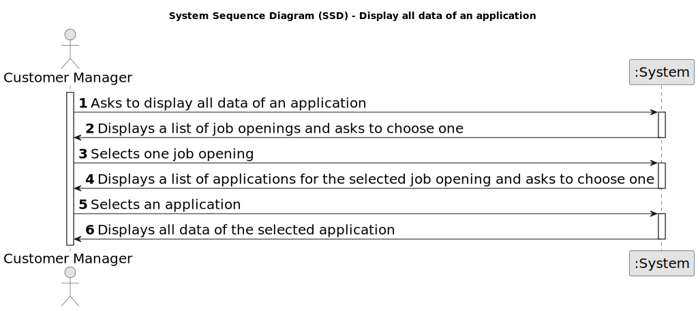

# US 1021 - Display all the data of an application.

## 1. Requirements Engineering

### 1.1. User Story Description

* As Customer Manager, I want to display all the data of an application

### 1.2. Customer Specifications and Clarifications

**From the specifications document:**

There is an Applications Email Bot (outside of scope for this project) that is continuously processing these emails. The Bot processes the emails and produces (in a predefined folder) the following content/files (using the same file prefix for files of the same application):

  • A text file with the contents of the email

  • A file for each file attached to the email (usually PDF files)

  • A text file with the contents of each file attached to the email (processed by an OCR tool)

  • A text file with the data of the application and candidate, with at least:
  
    – job reference
    – email of the candidate
    – name of the candidate
    – phone number of the candidate

**From the client clarifications:**

> **Date:** 23/03/2024
>
> **Question 36:** US1021, o que é “all data of an application”? O que é uma job application
>
> **Answer:** Uma job application é uma candidatura (de um candidato) a uma job opening. Relativamente ao “all data of an application” refere-se a todos os dados de uma candidatura, nomeadamente, os ficheiros submetidos pelos candidato assim como dados recolhidos ou gerados durante o processo (como as entrevistas e processamento de requisitos).

> **Date:** 17/05/2024
>
> **Question 179:** US1021 - Relativamente à US1021, como é que a Application a exibir é escolhida? O utilizador pode começar por selecionar uma Job Reference e depois o e-mail de um dos candidatos? Ou recomenda uma outra abordagem?
> 
> **Answer:** Devem aplicar melhores práticas de UX/UI. Já houve perguntas anteriores sobre assuntos similares (ex: Q150). Note que existe uma US para listar todas as candidaturas a um job opening, por exemplo

> **Date:** 18/05/2024
>
> **Question 184:** US1021- Em relação à listagem dos dados de uma determinada jobApplication, um customer manager vai ter acesso a todas as jobApplications do sistema ou apenas às jobApplications feitas para uma job opening de um cliente que é gerido por esse customer manager?
>
> **Answer:** Apenas às que está a gerir.

> **Date:** 19/05/2024
>
> **Question 188:** US1021 – Listagem das applications - Gostaria de abordar um ponto específico relacionado à UI/UX User Story 1021. Eu sei que o cliente tem vindo a referir que devemos aplicar melhores práticas de UX/UI e que preferia não constrangir a forma como desenhamos a UI/UX. No entanto, a nossa preocupação é que, nesta US, no caso de haver um grande número de aplicações, a exibição de todas essas informações de uma vez poderá ficar confusa para o user. Por isso, queria apenas perguntar se poderíamos adotar uma solucão um pouco mais prática, como, por exemplo, pedir ao user para selecionar uma job opening e só depois listar as applications associadas a essa job opening e os dados dessas applications ou se, na sua visão, esta abordagem poderia restringir demasiadamente as opções oferecidas por esta funcionalidade.
> 
> **Answer:** Ver Q36. Esta US é para mostrar os dados de uma (1) candidatura. Deve haver uma forma do Customer Manager indicar (incluindo, eventualmente, forma de selecionar/”saber”/”pesquisar”) qual a candidatura (i.e., application) e o sistema mostra os dados dessa candidatura.

> **Date:** 21/05/2024
> 
> **Question 202:** US1021 – Quando se diz mostrar todo os dados de uma candidatura isso inclui, por exemplo, todos os dados do candidato, todos os dados da job opening relativa a essa candidatura, etc? Ou apenas, o id da job opening, o email do candidato, etc? Alem do curriculo claro.
>
> **Answer:** Ver Q36.

### 1.3. Acceptance Criteria

**AC 1:** All data collected or generated during the process must be displayed.

### 1.4. Found out Dependencies

* **US 2002 - Create Application:** To display the data of an application, it is necessary to have applications created in the system.

### 1.5 Input and Output Data

**Input Data:**

* Selected Data:
  * Job Opening
  * Application

**Output Data:**

* List of Job Openings
* List of Applications
* All data of an Application

### 1.6. System Sequence Diagram (SSD)

