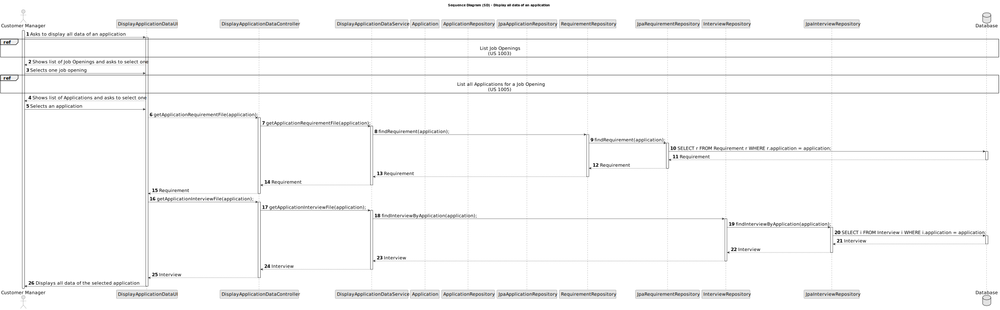

# US 1021 - Display all the data of an application.

## 3. Design - User Story Realization

### 3.1 Rationale

| Interaction ID | Question: Which class is responsible for... | Answer               | Justification (with patterns)                                                                                 |
|:-------------  |:--------------------- |:---------------------|:--------------------------------------------------------------------------------------------------------------|
| Step 1  		 |	... interacting with the actor? | DisplayApplicationDataUI          | Pure Fabrication: there is no reason to assign this responsibility to any existing class in the Domain Model. |
| 			  		 |	... coordinating the US? | DisplayApplicationDataController | Controller: The controller is responsible for handling the user's request and coordinating the use case. |
| 			  		 |	... querying the database for requirements?						 | RequirementRepository         | Information Expert: The RequirementRepository knows how to interact with the database. |
| 			  		 |	... querying the database for interviews?						 | InterviewRepository         | Information Expert: The InterviewRepository knows how to interact with the database. |
| 			  		 |	... querying the database for applications?						 | ApplicationRepository         | Information Expert: The ApplicationRepository knows how to interact with the database. |

### Systematization

According to the taken rationale, the conceptual classes promoted to software classes are:

* Application

Other software classes (i.e. Pure Fabrication) identified:

* DisplayApplicationDataUI
* DisplayApplicationDataController
* DisplayApplicationDataService
* RequirementRepository
* JpaRequirementRepository
* InterviewRepository
* JpaInterviewRepository
* ApplicationRepository
* JpaApplicationRepository

These classes are responsible for the user interface, controlling the use cases, and interacting with the database, respectively.

## 3.2. Sequence Diagram (SD)

## 3.3. Class Diagram (CD)

