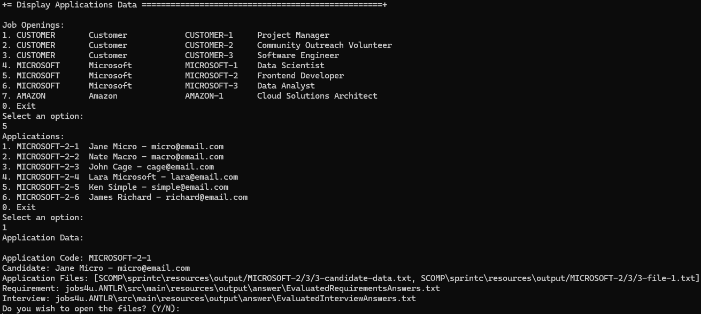

# US 1021 - Display all the data of an application.

# 4. Tests

**Some tests of the DisplayApplicationDataController class**
```java
@BeforeEach
public void setup() {
    MockitoAnnotations.openMocks(this);
    controller = new DisplayApplicationDataController(requirementRepository, interviewRepository, authz);
    displayApplicationDataService = new DisplayApplicationDataService(requirementRepository, interviewRepository);
}

@Test
public void testGetApplicationRequirementFile() {
    Application application = mock(Application.class);
    Requirement expectedRequirement = mock(Requirement.class);
    when(displayApplicationDataService.getApplicationRequirementFile(application))
            .thenReturn(Optional.of(expectedRequirement));

    Optional<Requirement> result = controller.getApplicationRequirementFile(application);

    verify(authz).ensureAuthenticatedUserHasAnyOf(BaseRoles.CUSTOMER_MANAGER, BaseRoles.POWERUSER);
    assertTrue(result.isPresent());
    assertEquals(expectedRequirement, result.get());
}

@Test
public void testGetApplicationInterviewFile() {
    Application application = mock(Application.class);
    Interview expectedInterview = mock(Interview.class);
    when(displayApplicationDataService.getApplicationInterviewFile(application))
            .thenReturn(Optional.of(expectedInterview));

    Optional<Interview> result = controller.getApplicationInterviewFile(application);

    verify(authz).ensureAuthenticatedUserHasAnyOf(BaseRoles.CUSTOMER_MANAGER, BaseRoles.POWERUSER);
    assertTrue(result.isPresent());
    assertEquals(expectedInterview, result.get());
}
```

**Some tests of the DisplayApplicationDataService class**
```java
@BeforeEach
public void setup() {
    MockitoAnnotations.openMocks(this);
    service = new DisplayApplicationDataService(requirementRepository, interviewRepository);
}

@Test
public void testGetApplicationRequirementFile() {
    Application application = mock(Application.class);
    Requirement expectedRequirement = mock(Requirement.class);
    when(requirementRepository.findRequirement(application)).thenReturn(Optional.of(expectedRequirement));

    Optional<Requirement> result = service.getApplicationRequirementFile(application);

    assertTrue(result.isPresent());
    assertEquals(expectedRequirement, result.get());
}

@Test
public void testGetApplicationInterviewFile() {
    Application application = mock(Application.class);
    Interview expectedInterview = mock(Interview.class);
    when(interviewRepository.findInterviewByApplication(application)).thenReturn(Optional.of(expectedInterview));

    Optional<Interview> result = service.getApplicationInterviewFile(application);

    assertTrue(result.isPresent());
    assertEquals(expectedInterview, result.get());
}
```

# 5. Construction (Implementation)

**DisplayApplicationDataController**
```java
@UseCaseController
public class DisplayApplicationDataController {

    private final DisplayApplicationDataService displayApplicationDataService;
    private final AuthorizationService authz;

    public DisplayApplicationDataController(final RequirementRepository requirementRepository,
            final InterviewRepository interviewRepository, final AuthorizationService authz) {
        this.displayApplicationDataService = new DisplayApplicationDataService(requirementRepository,
                interviewRepository);
        this.authz = authz;
    }

    public Optional<Requirement> getApplicationRequirementFile(final Application application) {
        authz.ensureAuthenticatedUserHasAnyOf(BaseRoles.CUSTOMER_MANAGER, BaseRoles.POWERUSER);
        return displayApplicationDataService.getApplicationRequirementFile(application);
    }

    public Optional<Interview> getApplicationInterviewFile(final Application application) {
        authz.ensureAuthenticatedUserHasAnyOf(BaseRoles.CUSTOMER_MANAGER, BaseRoles.POWERUSER);
        return displayApplicationDataService.getApplicationInterviewFile(application);
    }
}
```

**DisplayApplicationDataService**
```java
public class DisplayApplicationDataService {

    private final RequirementRepository requirementRepository;
    private final InterviewRepository interviewRepository;

    public DisplayApplicationDataService(final RequirementRepository requirementRepository,
            final InterviewRepository interviewRepository) {
        this.requirementRepository = requirementRepository;
        this.interviewRepository = interviewRepository;
    }

    public Optional<Requirement> getApplicationRequirementFile(final Application application) {
        return requirementRepository.findRequirement(application);
    }

    public Optional<Interview> getApplicationInterviewFile(final Application application) {
        return interviewRepository.findInterviewByApplication(application);
    }

}
```

# 6. Integration and Demo 

In the following image, we can see a demonstration of the system displaying all data of an application.

<p align="center">Displaying all data of an application</p>



In order to display all the data of an application, the user must select a job opening and an application. The system will display all the data of the selected application, this includes the candidate's information and the application information including the paths to all the files generated by the system during the recruitment process.

# 7. Observations

The implementation of displaying all data of an application was successfully implemented. The system allows the user to see all the data of an application.

