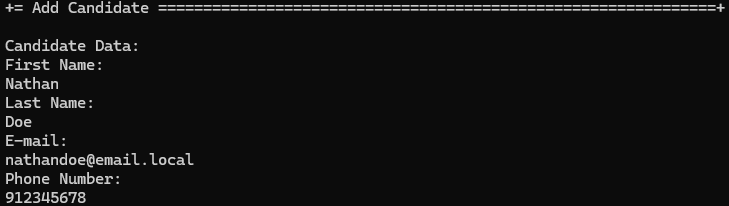

# US 1021 - Display all the data of an application.

# 4. Tests 

**Some tests of the Candidate Class**
```java
    @Test
    public void ensureCandidateEqualsPassesForTheSameEmail() throws Exception {

        final Candidate aCustomer = getNewDummyCandidate(aEmail);

        final Candidate anotherCustomer = getNewDummyCandidate(aEmail);

        final boolean expected = aCustomer.equals(anotherCustomer);

        assertTrue(expected);
    }

    @Test
    public void ensureCandidateEqualsFailsForDifferenteEmail() throws Exception {
        final Set<Role> roles = new HashSet<>();
        roles.add(BaseRoles.ADMIN);

        final Candidate aCustomer = getNewDummyCandidate(aEmail);

        final Candidate anotherCustomer = getNewDummyCandidate(anotherEmail);

        final boolean expected = aCustomer.equals(anotherCustomer);

        assertFalse(expected);
    }

    @Test
    public void ensureCandidateEqualsAreTheSameForTheSameInstance() throws Exception {
        final Candidate aCustomer = getNewDummyCandidate(aEmail);

        final boolean expected = aCustomer.equals(aCustomer);

        assertTrue(expected);
    }

    @Test
    public void ensureCandidateEqualsFailsForDifferenteObjectTypes() throws Exception {
        final Candidate aCustomer = getNewDummyCandidate(aEmail);

        final boolean expected = aCustomer.equals(getNewDummyCandidate(anotherEmail));

        assertFalse(expected);
    }

    @Test
    public void ensureCandidateIsTheSameAsItsInstance() throws Exception {
        final Candidate aCustomer = getNewDummyCandidate(aEmail);

        final boolean expected = aCustomer.sameAs(aCustomer);

        assertTrue(expected);
    }

    @Test
    public void ensureTwoCandidatesWithDifferentEmailAreNotTheSame() throws Exception {
        final Candidate aCustomer = dummyCandidate(aEmail);
        final Candidate anotherCustomer = dummyCandidate(anotherEmail);

        final boolean expected = aCustomer.sameAs(anotherCustomer);

        assertFalse(expected);
    }
```

# 5. Construction (Implementation)

**RegisterCandidateController**
```java
    public Candidate registerCandidate(final String firstName, final String lastName,
            final String email, final String phoneNumber) {
        authz.ensureAuthenticatedUserHasAnyOf(BaseRoles.OPERATOR, BaseRoles.POWERUSER);
        final UserSession s = authz.session().orElseThrow(IllegalStateException::new);
        final SystemUser creator = s.authenticatedUser();
        return createCandidate(firstName, lastName, email, phoneNumber, creator);
    }

    public CandidateUser registerCandidateUser(final Candidate candidate,
            final SystemUser systemUser) {
        authz.ensureAuthenticatedUserHasAnyOf(BaseRoles.OPERATOR, BaseRoles.POWERUSER);
        return createCandidateUser(candidate, systemUser);
    }

    private Candidate createCandidate(final String firstName, final String lastName,
            final String email, final String phoneNumber, final SystemUser creator) {
        final Candidate candidate = doCreateCandidate(firstName, lastName, email, phoneNumber, creator);
        return candidateRepository.save(candidate);
    }

    private CandidateUser createCandidateUser(final Candidate candidate,
            final SystemUser systemUser) {
        final CandidateUser candidateUser = doCreateCandidateUser(candidate, systemUser);
        return candidateUserRepository.save(candidateUser);
    }

    private Candidate doCreateCandidate(final String firstName, final String lastName,
            final String email, final String phoneNumber, final SystemUser creator) {
        return new CandidateBuilder().with(firstName, lastName,
                email, phoneNumber, creator).build();
    }

    private CandidateUser doCreateCandidateUser(final Candidate candidate,
            final SystemUser systemUser) {
        return new CandidateUserBuilder().with(candidate,
                systemUser).build();
    }
```

# 6. Integration and Demo 

In the following image, we can see a demonstration of registering a candidate and creating a corresponding user.

<p align="center">Registering a candidate</p>



# 7. Observations

The implementation of registering a candidate and creating a corresponding user was completed.

