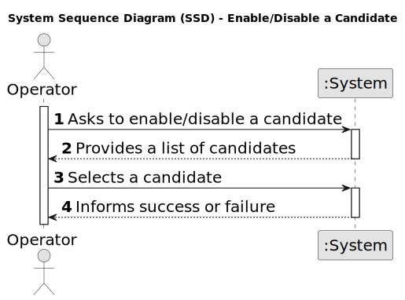

# US 2000b - Enable/disable a candidate

## 1. Requirements Engineering

### 1.1. User Story Description

* As Operator, I want to enable/disable a candidate

### 1.2. Customer Specifications and Clarifications

**From the specifications document:**

_N/A_

**From the client clarifications:**

> **Date:** 21/03/2024
>
> **Question 23:** A mudança de estado é referente ao candidato ou à candidatura individual e como se relaciona com o enable/disable dos utilizadores?
>
> **Answer:** O enable/disable dos users é apenas para controlar os acessos ao sistema. O estado, no processo de candidatura, é o estado da candidatura de um candidato a um job opening, não está diretamente relacionado com o enable/disable dos users.

> **Date:** 23/03/2024
>
> **Question 30:** US2000b, o que é o enable/disable do candidato?
>
> **Answer:** (alguma referencia a Q23). Refere-se a desativar o acesso do candidato ao sistema (i.e., Candidate App).

> **Date:** 16/04/2024
>
> **Question 72:** Multiple enable/disable (US1000) – Can a user (from the backoffice, for example) be enabled/disabled multiple times?
>
> **Answer:** Yes.

> **Date:** 13/05/2024
>
> **Question 146:** US 2000b – for the use case 2000b which states "As Operator, I want to enable/disable a candidate". I would like to know if the client would like two different menus to be created, with each menu responsible for either activating or deactivating candidates.
>
> **Answer:** I have no specific requirements for the UX/UI but I want you to follow best practices.

### 1.3. Acceptance Criteria

* **AC 1:** It must be possible to enable/disable a candidate multiple times.

* **AC 2:** The disablement of a candidate must prevent the candidate from accessing the system and not define the candidate's status in the recruitment process.

### 1.4. Found out Dependencies

* **US 1007 - Setup the phases of the process for a job opening:** The Recruitment Process must be defined before the verification process can be executed.

### 1.5 Input and Output Data

**Input Data:**

* Selected data:
	* Candidate
	* Action (enable/disable)

**Output Data:**

* (In)Success of the operation

### 1.6. System Sequence Diagram (SSD)

