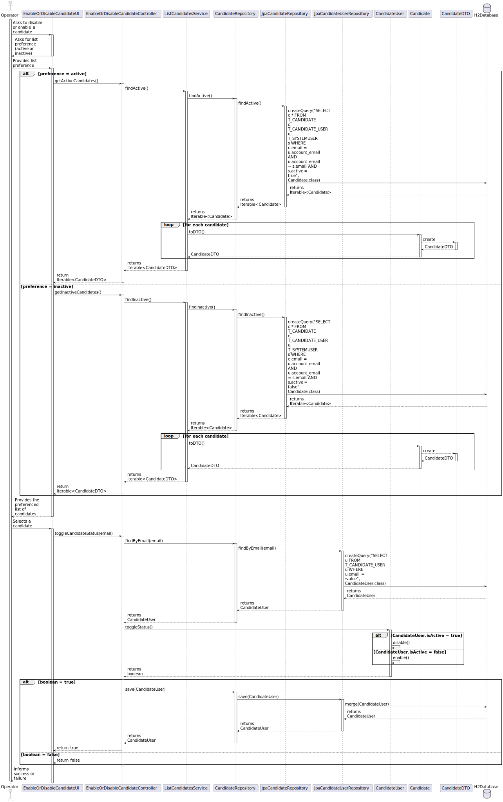

# US 2000b - Enable/disable a candidate

## 3. Design - User Story Realization

### 3.1 Rationale

#### 3.1.2. Enable/Disable Users

| Interaction ID | Question: Which class is responsible for... | Answer               | Justification (with patterns)                                                                                 |
|:-------------  |:--------------------- |:---------------------|:--------------------------------------------------------------------------------------------------------------|
| Step 1  		 |	... interacting with the actor? | EnableDisableCandidateUI          | Pure Fabrication: there is no reason to assign this responsibility to any existing class in the Domain Model. |
| Step 2  		 |	... coordinating the US? | EnableDisableCandidateController | Controller: The controller is responsible for handling the user's request and coordinating the use case.Controller                                                                                                    |
| Step 3		 |	... finding the active or inactive users?						 | CandidateUserRepository	         | Information Expert: The repository knows how to find users based on their active status.                                                                       |
| Step 4		 |	... querying the database?						 | JpaCandidateUserRepository         | Information Expert: The JpaCandidateUserRepository knows how to interact with the database.                                                                             |
| Step 5		 |	... enabling or disabling the user?						 | CandidateUser         | 	Information Expert: The Candidate User class knows how to enable or disable itself.                                                                               |
| Step 6		 |	... saving the updated user?						 | CandidateUserRepository	         | Information Expert: The repository knows how to save a user.                                                                               |

Systematization
According to the taken rationale, the conceptual classes promoted to software classes are:

* CandidateUser

Other software classes (i.e. Pure Fabrication) identified:

* EnableDisableCandidateUI
* EnableDisableCandidateController
* CandidateUserRepository
* JpaCandidateUserRepository

These classes are responsible for the user interface, controlling the use case, and interacting with the database, respectively.

## 3.2. Sequence Diagram (SD)

## 3.3. Class Diagram (CD)

