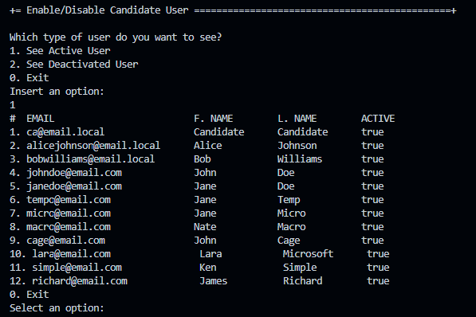

# US 2000b - Enable/disable a candidate

# 4. Tests 

**Tests for the EnableOrDisableCandidateController**

_N/A_ (Tests were already made in the EAPLI framework and base project)

# 5. Construction (Implementation)

**EnableOrDisableCandidateController**
```java
    public class EnableOrDisableCandidateUserController {

    private final AuthorizationService authz = AuthzRegistry.authorizationService();
    private final UserManagementService userSvc = AuthzRegistry.userService();

    public Iterable<SystemUser> activeUsers() {
        authz.ensureAuthenticatedUserHasAnyOf(BaseRoles.OPERATOR, BaseRoles.POWERUSER);

        return this.candidateUsers(userSvc.activeUsers());
    }

    public Iterable<SystemUser> deactivatedUsers() {
        authz.ensureAuthenticatedUserHasAnyOf(BaseRoles.OPERATOR, BaseRoles.POWERUSER);

        return this.candidateUsers(userSvc.deactivatedUsers());
    }

    public Iterable<SystemUser> candidateUsers(Iterable<SystemUser> systemUsers) {
        authz.ensureAuthenticatedUserHasAnyOf(BaseRoles.OPERATOR, BaseRoles.POWERUSER);

        List<SystemUser> userList = new ArrayList<>();
        systemUsers.forEach(userList::add);
        List<SystemUser> filtered = userList.stream()
                .filter(systemUser -> systemUser.hasAny(BaseRoles.CANDIDATE))
                .collect(Collectors.toList());
        return filtered;
    }

    public void enableOrDisableUser(SystemUser user, String newStatus) {
        authz.ensureAuthenticatedUserHasAnyOf(BaseRoles.OPERATOR, BaseRoles.POWERUSER);

        if (newStatus.equalsIgnoreCase("enable")) {
            userSvc.activateUser(user);
        } else if (newStatus.equalsIgnoreCase("disable")) {
            userSvc.deactivateUser(user);
        }
    }
}
```

# 6. Integration and Demo 

In the following image, we can see the implementation of the feature that allows the operator to enable or disable a candidate. The operator can access the candidate's profile and enable or disable the candidate by clicking on the "Enable" or "Disable" button. After clicking on the button, the operator will be able to disable the active candidates or enable the disabled candidates. The enablement or disablement of a candidate defines whether the candidate can use the candidate app or not.

<p align="center">Enable or Disable a Candidate</p>



# 7. Observations

The implementation of the feature that allows the operator to enable or disable a candidate was successfully completed. The system is now ready for this new feauture.

