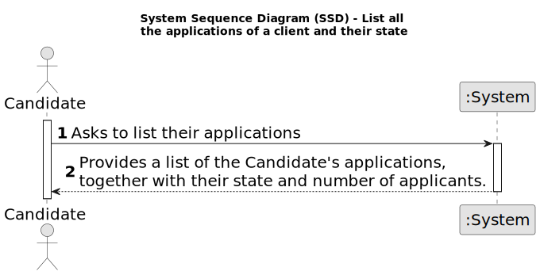

# US 3000 - List all the applications of a client and their state

## 1. Requirements Engineering

### 1.1. User Story Description

* As Candidate, I want to list all my applications and their state (including the number of applicants).

### 1.2. Customer Specifications and Clarifications

**From the specifications document:**

* Functionalities related to the Candidate and Customer Apps and to the Follow Up Server part of the system have very 
specific technical requirements. It must follow a client-server architecture, where a client application is used to 
access a server. Communications between these two components must follow specific protocol
described in a document from RCOMP ("Application Protocol"). Also, the client applications can not access the relational 
database, they can only access the server application.
* The solution should be deployed using several network nodes. It is expected that, at least, the relational database 
server and the Follow Up Server be deployed in nodes different from localhost, preferably in the cloud. The e-mail notification
  tasks must be executed in background by the Follow Up Server.

**From the client clarifications:**

N/A

### 1.3. Acceptance Criteria

* **AC 1:** The solution should be deployed using several network nodes.

* **AC 2:** The US should allow the client to see all their applications.

* **AC 3:** The Candidate App and the Follow Up Server should follow a client-server architecture.

### 1.4. Found out Dependencies

* **US 2000a:** The Candidate should first be registered in the database in order to list their applications.

* **US 2002:** Applications should first be registered in the database, so they can be listed.

### 1.5 Input and Output Data

**Input Data:**

**N/A**

**Output Data:**

* List of Applications

### 1.6. System Sequence Diagram (SSD)

